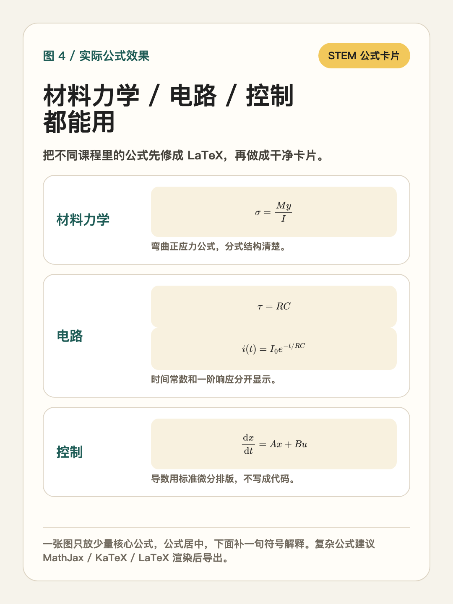

# Formula Image Fixer

> 中文说明在前，English version below.

一个很窄的 Codex Skill：专门在 AI 生图前修复公式。

它不是万能学习笔记生成器，也不是模板库。它只解决一个具体问题：AI 生成学习笔记图、理工科知识卡片、PPT 配图或小红书知识图时，公式容易变成代码感文本、伪公式、乱码或很丑的排版。

## 效果预览

### 1. 前后对比

同一个公式，直接丢给 AI 和先经过 LaTeX 修复，效果会差很多。


### 2. 常见翻车样式

很多公式人能看懂，但生图模型容易画崩，例如 `stress / strain`、`Mmax = PL/4`、`dx/dt = Ax + Bu`。


### 3. 核心修复规则

先把普通公式修成 LaTeX，再规定公式要单独居中、加符号解释、避免混进长段文字。


### 4. 实际公式效果

适合材料力学、电路、控制、机械、物理等带公式的理工科图片。



## 它修什么

错误写法：

```text
sigma = M*y/I
```

修复后：

```latex
\[
\sigma=\frac{My}{I}
\]
```

错误写法：

```text
E = stress / strain
Mmax = PL/4
dx/dt = Ax + Bu
```

修复后：

```latex
\[
E=\frac{\sigma}{\varepsilon}
\]

\[
M_{\max}=\frac{PL}{4}
\]

\[
\frac{\mathrm{d}x}{\mathrm{d}t}=Ax+Bu
\]
```

## 使用场景

- AI 生成学习笔记图片
- 理工科知识卡片
- 小红书知识图
- 带公式的 PPT 配图
- 材料力学、电路、控制、机械、物理、工程类公式图

## 安装

把这个文件夹复制到 Codex skills 目录：

```bash
mkdir -p ~/.codex/skills
cp -R formula-image-fixer ~/.codex/skills/formula-image-fixer
```

然后这样调用：

```text
Use $formula-image-fixer to repair the formulas in this image prompt before generation.
```

也可以中文调用：

```text
使用 $formula-image-fixer，把下面这个生图提示词里的公式修成 LaTeX，并给出适合生图的公式排版规则。
```

## 示例 Prompt

```text
Use $formula-image-fixer.

Prepare this content for AI image generation:

Title: bending stress formula
Formula: sigma = M*y/I
Style: clean STEM knowledge card

Make the formula LaTeX-safe, centered, and add a short symbol explanation.
```

## 核心规则

1. 把所有普通文本公式、代码感公式转换成 LaTeX。
2. 分式统一使用 `\frac{}{}`。
3. 规范上下标、希腊字母、导数、积分、求和、矩阵、向量。
4. 重要公式使用 display math，不混在长段文字里。
5. 核心公式单独居中。
6. 公式下方添加简短符号解释。
7. 图片风格保持干净：教材、白板、理工科知识卡片。
8. 避免公式乱码、伪代码文本、装饰性公式背景、过小不可读公式。

## 仓库结构

```text
formula-image-fixer/
├── SKILL.md
├── README.md
├── LICENSE
├── agents/
│   └── openai.yaml
└── assets/
    ├── formula-safe-prompt-template.txt
    └── images/
        ├── formula_fixer_01_before_after.png
        ├── formula_fixer_02_failures.png
        ├── formula_fixer_03_rules.png
        └── formula_fixer_04_examples.png
```

## License

MIT

---

# English Version

A narrow Codex Skill for fixing formulas before AI image generation.

This is not a general study-notes generator or a template library. It is a small formula preflight tool for prompts and visuals that contain math, physics, engineering, or STEM formulas.

Its only job is to reduce formula failures in AI-generated images: code-like text, fake math, garbled symbols, and messy equation layout.

## Visual Preview

### 1. Before and After

The same formula looks very different when it is repaired into LaTeX before image generation.


### 2. Common Failure Patterns

Some formulas are readable to humans but unstable for image models, such as `stress / strain`, `Mmax = PL/4`, and `dx/dt = Ax + Bu`.


### 3. Core Repair Rules

Convert plain formulas into LaTeX first, then specify centered formula layout, symbol explanations, and clean visual hierarchy.


### 4. STEM Formula Examples

Useful for materials mechanics, circuits, control systems, mechanics, physics, and engineering formula cards.


## What It Fixes

Bad:

```text
sigma = M*y/I
```

Good:

```latex
\[
\sigma=\frac{My}{I}
\]
```

Bad:

```text
E = stress / strain
Mmax = PL/4
dx/dt = Ax + Bu
```

Good:

```latex
\[
E=\frac{\sigma}{\varepsilon}
\]

\[
M_{\max}=\frac{PL}{4}
\]

\[
\frac{\mathrm{d}x}{\mathrm{d}t}=Ax+Bu
\]
```

## Use Cases

- AI-generated study-note images
- STEM knowledge cards
- Xiaohongshu educational visuals
- PPT illustrations with formulas
- Materials mechanics, circuits, control systems, mechanics, physics, and engineering formula cards

## Install

Copy this folder into your Codex skills directory:

```bash
mkdir -p ~/.codex/skills
cp -R formula-image-fixer ~/.codex/skills/formula-image-fixer
```

Then invoke it with:

```text
Use $formula-image-fixer to repair the formulas in this image prompt before generation.
```

## Example Prompt

```text
Use $formula-image-fixer.

Prepare this content for AI image generation:

Title: bending stress formula
Formula: sigma = M*y/I
Style: clean STEM knowledge card

Make the formula LaTeX-safe, centered, and add a short symbol explanation.
```

## Core Rules

1. Convert all plain-text or code-like formulas into LaTeX.
2. Use `\frac{}{}` for fractions.
3. Use correct subscripts, superscripts, Greek letters, derivatives, integrals, sums, matrices, and vectors.
4. Put important formulas in display math blocks.
5. Do not mix formulas inside long paragraphs.
6. Add brief symbol explanations under core formulas.
7. Keep the image style clean: textbook, whiteboard, or STEM knowledge card.
8. Avoid garbled formulas, fake code text, decorative formula clutter, and tiny unreadable equations.

## Repository Contents

```text
formula-image-fixer/
├── SKILL.md
├── README.md
├── LICENSE
├── agents/
│   └── openai.yaml
└── assets/
    ├── formula-safe-prompt-template.txt
    └── images/
        ├── formula_fixer_01_before_after.png
        ├── formula_fixer_02_failures.png
        ├── formula_fixer_03_rules.png
        └── formula_fixer_04_examples.png
```

## License

MIT
